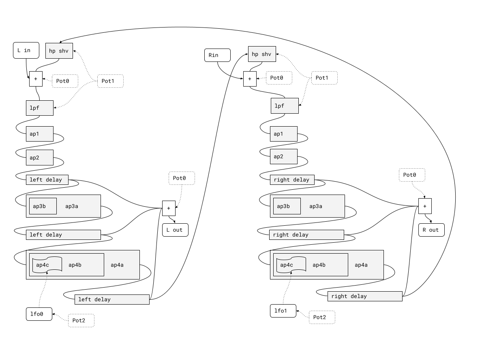

## Waltham Programs

The Waltham programs are a simplified interpretation of the concert hall program
from one of the well known early digital reverbs.

The parameters for reverb time and equalization are greatly simplified to
accommodate the small number of controls. The original four controls are
combined into one reverb time control and one tone control which tilts the reverb
from being low to high end focused. The tone control is in the feedback path,
so it also affects the reverberation time of the affected frequencies.

### Topology

This topology is an "allpass loop" but it is very different from the
allpass loop style reverbs popularized by Alesis and commonly seen on the FV-1.
The nesting of the all passes makes it sound completely different.

One of its nice qualities is that it does not introduce a very slow attack to
the reverberated signal, and it builds diffusion slowly without delaying the
signal for too long. The tradeoff is that it can sound quite colored on some
sources. In general, it is not great for material with strong transients.

Each side of the loop goes through the following stages:

1.  A 1 pole high pass shelving filter, cutting low end.
2.  A 1 pole low pass filter, cutting high end.
3.  Two short all pass diffusers
4.  A medium sized all pass diffuser, with another all pass nested within it.
5.  A large sized all pass diffuser, triply nested.

Further details:

1.  There are three logical places to take output taps. Some programs use the
    earlier taps, and some use the later ones. The mix is weighted by pot0,
    to make longer reverbs denser than shorter ones. This is a compromise
    in place of a dedicated "distance" parameter.
2.  The diffusion amount is fixed in each program. It costs too many instructions
    to make diffusion variable for so many all passes. The diffusion coefficients
    have a dramatic effect on the sound of this algorithm, so if you want to start
    tweaking it, you might want to start there to get a feel for it.
3.  The LFOs are used to add modulation to the most deeply nested all pass.
    The two ramps and sin LFOs are interconnected in a chaotic matrix that
    produces a pair of quasi-random, continuously variable modulation signals.
